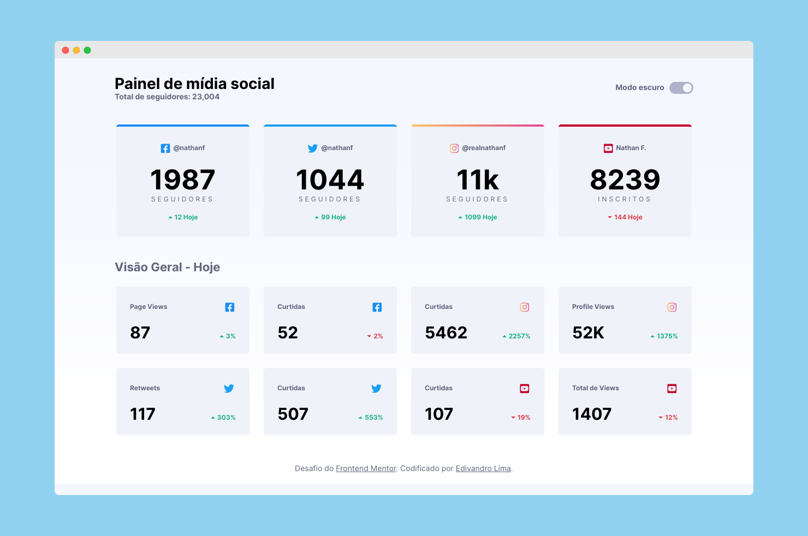

# Painel de mídia social com alternador de tema

Este é meu envio ao desafio do [Frotend Mentor](https://www.frontendmentor.io/profile/EdivandroLima).

Clique [aqui](https://fem-painel-de-midia-social.vercel.app/) para ver como ficou.

## Ferramentas utilizadas
- [x] HTML5
- [x] CSS3
- [x] JavaScript
- [x] Google Fonts
- [x] Normalize
- [x] HTML5Shive

